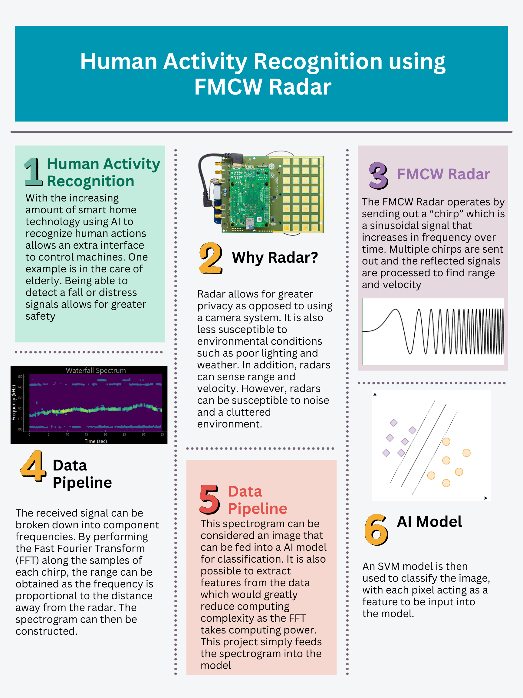

<h1 align="center">
 FMCW Radar: Human Activity Recognition
</h1>

 Patrick Nguyen

<h1 align="left">
Project Summary
</h1>
 

   This project uses the CN0566 Radar Eval Kit from Analog Devices to create an FMCW Radar to retrieve range and velocity information which can then be used to identify whether or not a person is waving using a machine learning model

  video demo: https://youtube.com/shorts/cu3s1KRIo6I?feature=share
 

## Overview
The kit is comprised of the phaser which contains the analog circuitry to receive and transmit the rf signals, the Pluto SDR to do digital signal processing, and a raspberry pi. The raspberry pi or another host machine can use the analog devices python iio libraries to program and configure the phaser and SDR. 
 
The phaser board uses a phased array antenna system to receive rf signals. The ADAR1000 chips on the phaser board are used to shift the phase and amplitude (which can be programmed) and sum the signals from the antenna elements.

The phaser will filter and convert the signals to a usable frequency by the SDR. The SDR will sample the signals and then do analog to digital conversion and store the data in a buffer. Commands can be sent (via the raspberry pi or an external host machine) to read the buffers of data as well as configure what signals to transmit.

This project uses frequency modulated continuous wave (FMCW) signals. A continuous wave signal allows us to calculate the velocity of targets as any variation in frequency due to the doppler effect indicates a moving target. 
By modulating the frequency (in this case linearly) of the continuous wave signal, the range of a target can be calculated. As the modulated signal comes back, the difference between the frequency of the currently transmitted signal and the received signal (called the beat frequency) allows us to measure the range.

All of these calculations require the information on the frequency of the received signal. To find the frequency of a signal on a limited buffer of data, the fast fourier transform (FFT) is used to break the signal down into component frequencies. The information on the frequencies and 
corresponding amplitudes is called a frequency spectrum and is an "instantaneous" snapshot of the frequency of the signal. The FFT is performed on a buffer of data spanning a "chirp" of data. A chirp of data contains one cycle of frequency ramping/modulation and lasts 500 microseconds in our configuration, a time small enough for us to call an instantaneous snapshot of frequency data.

The frequency information of multiple chirps of data is plotted over time. This gives what is know as a waterfall plot, or spectrogram. This is a 3 dimensional array of data, but using a color map to represent the amplitudes, it can be viewed on a 2D plot.

The spectrogram is essentially an image. The plot is fed into a machine learning classification model to identify whether the spectrogram is reminiscent of a human target that is waving or not waving. In this project the model I used is a SVM, or support vector machine.

## Future Considerations and Improvements
There are many areas of improvement for this project as this was an introduction to signal processing, RF theory, and AI/machine learning for me. There are many different AI models and techniques that can be explored to increase accuracy. This project also only focuses on single target and binary classification.

## Project Infographic
 
